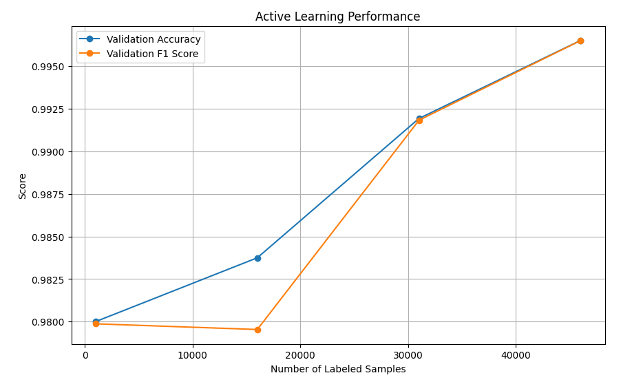

# Active Virulence Prediction using Evolutionary Scale Modeling
[](https://pytorch.org/)
[](https://huggingface.co/docs/transformers/index)
[](https://ai.meta.com/research/)
[](https://streamlit.io)

This repository contains the code used for training the protein virulence classification model and a web interface that can be used for making predictions. The project fine-tuned a ESM-2 protein language model to predict whether a protein sequence is a virulence factor or not.

## 📁 Repository Structure

  * `app.py`: The Streamlit web interface code for making predictions.
  * `training.py`: The Python script used for training the ESM-2 model with an active learning approach.
  * `.plots/`: Directory containing all the generated plots.

## 🚀 Web Interface

The `app.py` script provides a user-friendly web interface built with **Streamlit** that allows you to paste a protein sequence and get a real-time prediction. It uses the fine-tuned models hosted on Hugging Face: `kssrikar4/AVP-ESM2-8m` and `kssrikar4/AVP-ESM2-35m`.

### How to Run the App

1.  **Clone this repository:**
    ```bash
    git clone https://github.com/kssrikar4/AVP-ESM.git
    cd AVP-ESM
    ```
2.  **Install dependencies:**
    ```bash
    python -m venv py
    source py/bin/activate  # On Windows: `py\Scripts\activate`
    pip install -r requirements.txt
    ```
3.  **Run the Streamlit app:**
    ```bash
    streamlit run app.py
    ```
    
## 🧠 Model Details

The core of this project is a fine-tuned `facebook/esm2_t6_8m_ur50d` protein language model. It's designed for the binary classification of protein sequences, distinguishing between virulence factors and non-virulence factors.

**Intended Use:** The primary purpose of this model is to assist in bioinformatics research, drug discovery, and pathogen analysis. It is **not intended for clinical diagnostic purposes**.

### Data Sources

The model was trained on a curated dataset of protein sequences from various sources.

  * **Positive Data (Virulence Factors):**

      * **VFDB** (Virulence Factor Database)
      * **VPAgs-Dataset4ML**
      * **VirulentPred 2.0**

  * **Negative Data (Non-Virulence Factors):**

      * **VPAgs-Dataset4ML**
      * **VirulentPred 2.0**
      * **InterPro**

### Training Procedure

The model is fine-tuned using a multi-iteration **active learning approach** to improve its performance by focusing on the most challenging examples.

**Training Strategy:**

1.  **Initial Training:** The model was initially trained on a small, randomly sampled subset of the labeled data.
2.  **Iterative Querying:** The model predicted on a large pool of unlabeled data.
3.  **Uncertainty Sampling:** The most uncertain samples were identified using a **Least Confidence querying strategy**.
4.  **Re-labeling and Retraining:** These newly selected samples were added to the labeled training set, and the model was retrained on the expanded dataset.

## 📊 Evaluation & Performance of 8M model

The model's performance was evaluated on a held-out test set to provide an unbiased measure of its effectiveness.

#### Intermediate Evaluation on Validation Set
This report reflects the model's performance on a validation set. This data was used during the training loop to monitor progress and guide the active learning strategy, allowing the model to focus on the most uncertain examples. The perfect scores indicate strong performance on the data it was exposed to during the retraining process.

| Class | Precision | Recall | F1-Score | Support |
| :--- | :--- | :--- | :--- | :--- |
| Non-Virulent | 1.00 | 1.00 | 1.00 | 2458 |
| Virulent | 1.00 | 1.00 | 1.00 | 2642 |
| **Accuracy** | **-** | **-** | **1.00** | **5100** |
| **Macro Avg** | **1.00** | **1.00** | **1.00** | **5100** |
| **Weighted Avg** | **1.00** | **1.00** | **1.00** | **5100** |

* **Intermediate Evaluation Confusion Matrix:**

_A detailed breakdown of correct and incorrect predictions on the validaion set._

#### Final Evaluation on Held-out Test Set
This report presents the model's final, unbiased performance on data it has never seen. These metrics are the most reliable indicators of the model's performance on new, unseen protein sequences.

* **Final Test Accuracy:** 0.9507
* **Final Test F1 Score (Macro):** 0.9507

| Class | Precision | Recall | F1-Score | Support |
| :--- | :--- | :--- | :--- | :--- |
| Negative | 0.97 | 0.93 | 0.95 | 6492 |
| Positive | 0.94 | 0.97 | 0.95 | 6491 |
| **Accuracy** | **-** | **-** | **0.95** | **12983** |
| **Macro Avg** | **0.95** | **0.95** | **0.95** | **12983** |
| **Weighted Avg** | **0.95** | **0.95** | **0.95** | **12983** |

* **Final Test Accuracy Confusion Matrix:**

_A detailed breakdown of correct and incorrect predictions on the test set._

## 📊 Evaluation & Performance of 35M model

#### Intermediate Evaluation on Validation Set
This report reflects the model's performance on a validation set. This data was used during the training loop to monitor progress and guide the active learning strategy, allowing the model to focus on the most uncertain examples. The perfect scores indicate strong performance on the data it was exposed to during the retraining process.

| Class | Precision | Recall | F1-Score | Support |
| :--- | :--- | :--- | :--- | :--- |
| Non-Virulent | 1.00 | 1.00 | 1.00 | 2195 |
| Virulent | 1.00 | 1.00 | 1.00 | 2405 |
| **Accuracy** | **-** | **-** | **1.00** | **4600** |
| **Macro Avg** | **1.00** | **1.00** | **1.00** | **4600** |
| **Weighted Avg** | **1.00** | **1.00** | **1.00** | **4600** |

* **Intermediate Evaluation Confusion Matrix:**

_A detailed breakdown of correct and incorrect predictions on the validaion set._

#### Final Evaluation on Held-out Test Set
This report presents the model's final, unbiased performance on data it has never seen. These metrics are the most reliable indicators of the model's performance on new, unseen protein sequences.

* **Final Test Accuracy:** 0.9621
* **Final Test F1 Score (Macro):** 0.9621

| Class | Precision | Recall | F1-Score | Support |
| :--- | :--- | :--- | :--- | :--- |
| Negative | 0.96 | 0.96 | 0.96 | 6491 |
| Positive | 0.96 | 0.96 | 0.96 | 6492 |
| **Accuracy** | **-** | **-** | **0.96** | **12983** |
| **Macro Avg** | **0.96** | **0.96** | **0.96** | **12983** |
| **Weighted Avg** | **0.96** | **0.96** | **0.96** | **12983** |

* **Final Test Accuracy Confusion Matrix:**

_A detailed breakdown of correct and incorrect predictions on the test set._

## 📈 Visualizations

| Plot | Description |
| :--- | :--- |
| **Active Learning Performance**  | Shows the model's accuracy improvement over successive active learning iterations. |
| **CLS Embeddings (t-SNE)**  | Shows the separability of the positive and negative classes in a reduced-dimension space using t-SNE. |
| **CLS Embeddings (UMAP)**  | Shows the separability of the positive and negative classes in a reduced-dimension space using UMAP. |

## Visualizations of 8m model

The following plots provide further insight into the model's training process and performance.

* **Active Learning Performance:**

_This plot shows the model's accuracy improvement over successive active learning iterations._

* **CLS Embeddings Visualization (t-SNE):**

_This plot shows the separability of the positive and negative classes in a reduced-dimension space using t-SNE._

* **CLS Embeddings Visualization (UMAP):**

_This plot shows the separability of the positive and negative classes in a reduced-dimension space using UMAP._

## Visualizations of 35m model

The following visualizations provide further insight into the model's training process and performance.

* **Active Learning Performance:**

_This plot shows the model's accuracy improvement over successive active learning iterations._

* **CLS Embeddings Visualization (t-SNE):**

_This plot shows the separability of the positive and negative classes in a reduced-dimension space using t-SNE._

* **CLS Embeddings Visualization (UMAP):**

_This plot shows the separability of the positive and negative classes in a reduced-dimension space using UMAP._

## Acknowledgements

I would like to express my gratitude to the following organizations and projects for their foundational work and resources that made this project possible:

  * **Facebook AI Research (FAIR):** For creating and open-sourcing the **ESM-2** protein language model.
  * **PyTorch:** For providing an efficient deep learning framework used for all model training and inference.
  * **Hugging Face `transformers`:** For the user-friendly library that simplified the use of the pre-trained ESM-2 model and its tokenizer.
  * **Data Providers:** For making their valuable datasets publicly available. Our project was built upon data from:
      * [**VFDB**](https://www.mgc.ac.cn/VFs/download.htm)
      * [**VPAgs-Dataset4ML**](https://data.mendeley.com/datasets/w78tyrjz4z/1)
      * [**VirulentPred 2.0**](https://bioinfo.icgeb.res.in/virulent2/down.html)
      * [**InterPro**](https://www.ebi.ac.uk/interpro/)
  * **Google Gemini:** For its assistance in generating code.

## 📄 Licensing

This project is licensed under the **GNU Lesser General Public License v2.1 (LGPL-2.1)**.
